# 💰 MyWealthAI — Personal Finance Tracker & Advisor

<div align="center">


[](https://python.org)
[](https://flask.palletsprojects.com)
[](https://react.dev)
[](https://vitejs.dev)
[](https://tailwindcss.com)
[](https://scikit-learn.org)
[](https://console.groq.com)
[](https://pytest.org)

**An intelligent full-stack personal finance management platform powered by AI and Machine Learning.**

> *"Take Control of Your Financial Future"*

[📸 Screenshots](#-app-screenshots) • [✨ Features](#-features) • [🛠️ Tech Stack](#️-tech-stack) • [🚀 Getting Started](#-getting-started) • [🔌 API](#-api-reference) • [🧪 Tests](#-testing)

</div>

---

## 📖 About

**MyWealthAI** is an intelligent financial management platform that helps you track expenses, get personalized AI advice, and make smarter money decisions. It combines a **Python Flask REST API**, a **React 18 + Vite frontend**, **Random Forest ML models**, and a **Groq AI chatbot** — all amounts displayed in **Indian Rupee (₹)**.

> 🎓 Built as a Design Project — Academic Year 2025–2026

---

## 📸 App Screenshots

### 🏠 Landing Page
*"Take Control of Your Financial Future" — intelligent financial management platform powered by AI*


---

### ✨ Powerful Features for Your Financial Goals

| Smart Dashboard | AI Financial Advice | Advanced Analytics |
|---|---|---|
| Real-time overview of income, expenses, and savings with beautiful charts | Get personalized financial recommendations based on your spending patterns | ML-powered spending predictions, anomaly detection, and trend analysis |

| Easy Tracking | Smart Alerts | Personal Profile |
|---|---|---|
| Quickly add income and expense transactions with automatic categorization | Get notified about unusual spending patterns and anomalies | Manage your profile, view transaction history, and access all your financial data |

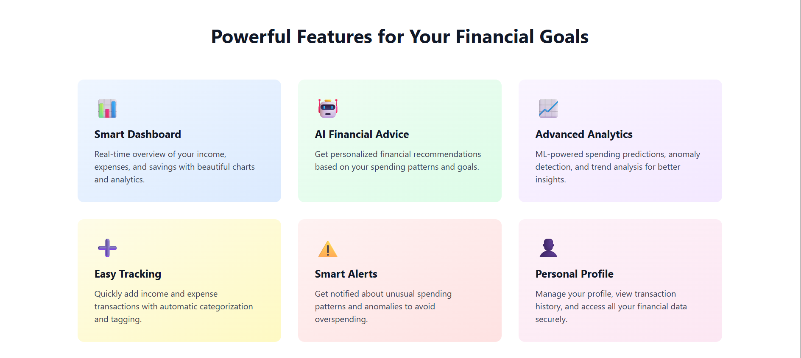

---

### ⚙️ How It Works

**4 simple steps to smarter finances:**

| Step | Action | Description |
|---|---|---|
| **1** | **Register** | Create your free account in seconds with your email and password |
| **2** | **Add Transactions** | Start logging your income and expenses to build your financial profile |
| **3** | **Get Insights** | View analytics dashboard and ML-powered predictions about your finances |
| **4** | **Take Action** | Use AI recommendations to improve your spending and reach your financial goals |

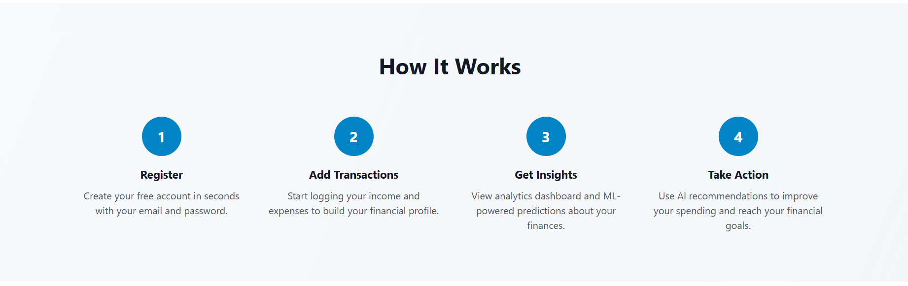

---

### 💡 Why Choose MyWealthAI?

**✨ Key Benefits:**
- ✅ **100% Free to Start** — No credit card required for basic features
- ✅ **Secure & Private** — Your data is encrypted and never shared
- ✅ **AI-Powered Insights** — Machine learning analyzes your patterns
- ✅ **Indian Rupee Support** — All amounts displayed in INR (₹)
- ✅ **Mobile Friendly** — Access your finances on any device

**📊 What You Get:**
- 📈 Financial Dashboard — Visualize your income, expenses, and savings
- 🤖 AI Recommendations — Personalized financial advice just for you
- 📊 Advanced Analytics — Spending trends, predictions, and anomalies
- ➕ Easy Expense Tracking — Quick logging with auto-categorization
- 🔐 Secure Authentication — JWT-based security for your account

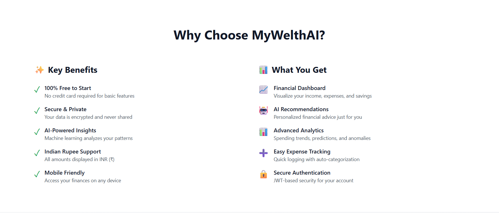

---

### 🛠️ Built with Modern Technology

| Frontend | Backend | Machine Learning |
|---|---|---|
| React 18 with Hooks | Flask 3.0 | Scikit-learn |
| Vite 5 (Lightning fast) | SQLAlchemy ORM | Pandas for data analysis |
| Tailwind CSS | SQLite Database | NumPy for computations |
| Chart.js for visualizations | JWT Authentication | Random Forest models |
| React Router for navigation | RESTful API | Statistical analysis |

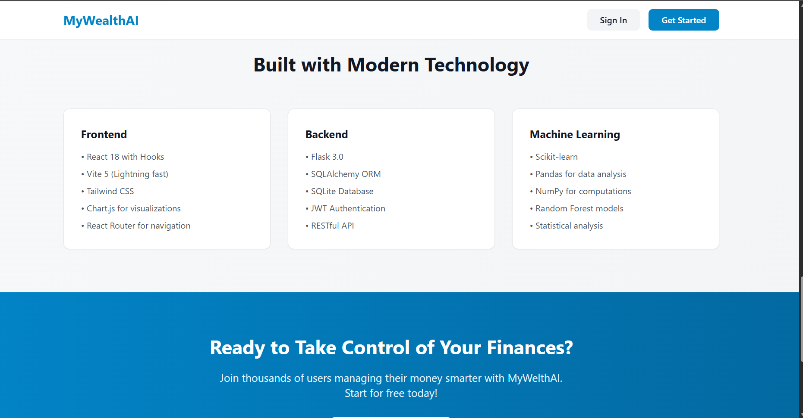

---

### 📝 Register — Create Your Account

*Fields: First Name, Last Name, Email Address, Password, Confirm Password*

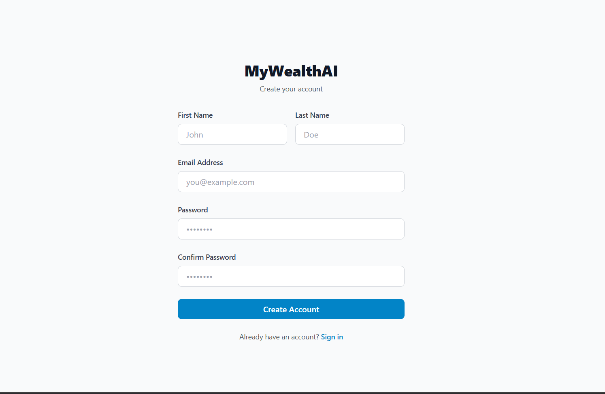

---

### 🔐 Sign In

*Fields: Email Address, Password — Don't have an account? Register*

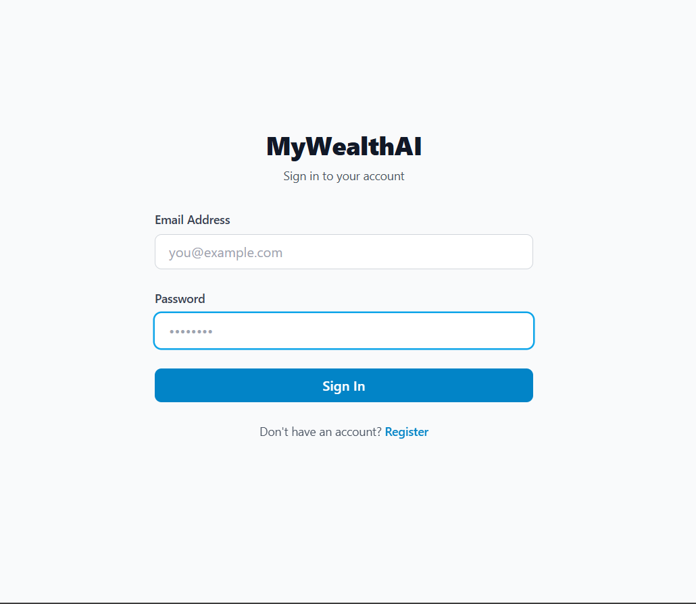

---

### 📊 Dashboard

**Financial overview for sumit pawar:**

| Card | Value |
|---|---|
| 💰 Total Balance | ₹10,94,113.00 |
| 📈 Total Income (This month) | ₹1,000.00 |
| 📉 Total Expenses (This month) | ₹0.00 |
| 💵 Total Savings | ₹1,000.00 |
| 📊 Savings Rate | 100.0% |

- **Income vs Expenses** bar chart (Oct 2025 – Feb 2026)
- **Expense Categories** colour-coded pie chart
- **Download Report** button for CSV export
- **Search transactions** bar

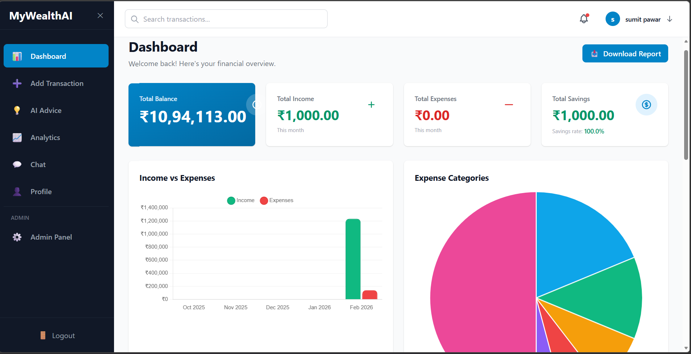

---

### 💳 Recent Transactions

*Description • Category • Date • Amount — Income in green (+), Expenses in red (−)*

| Description | Category | Date | Amount |
|---|---|---|---|
| — | Salary | 3/6/2026 | +₹1,000.00 |
| — | Entertainment | 2/23/2026 | -₹6,000.00 |
| Other | Other | 2/23/2026 | -₹50,000.00 |
| Travel | Transportation | 2/23/2026 | -₹7,900.00 |
| Food | Food & Dining | 2/22/2026 | -₹8,000.00 |

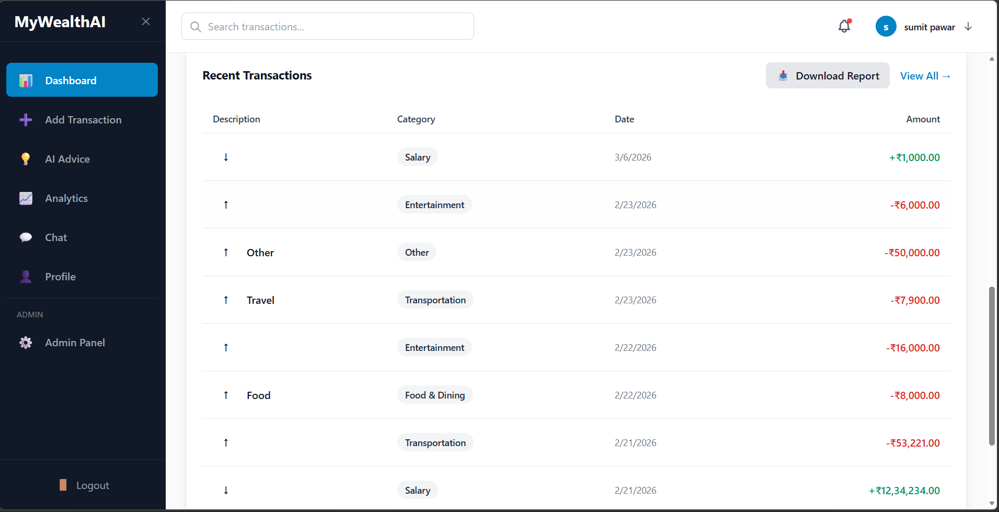

---

### ➕ Add Transaction

*Transaction Type: Income / Expense → Category → Amount → Description → Date*

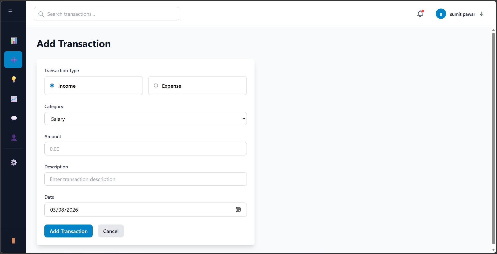

---

### 💡 AI Financial Advice
*Personalized recommendations based on your spending patterns*

- **Overspending Risk** — Score: 0.091 — **low**
- 💰 **Increase Savings Rate** `High Priority` — *"Your current savings rate is 20%. Try to increase it to 25% by reducing discretionary spending."*
- 🍽️ **Food Spending Alert** `Medium Priority` — *"Food & dining expenses increased by 15% this month. Consider meal planning to save money."*
- 🚗 **Transportation Opportunity** — *"You could save $150/month by optimizing transportation habits."*

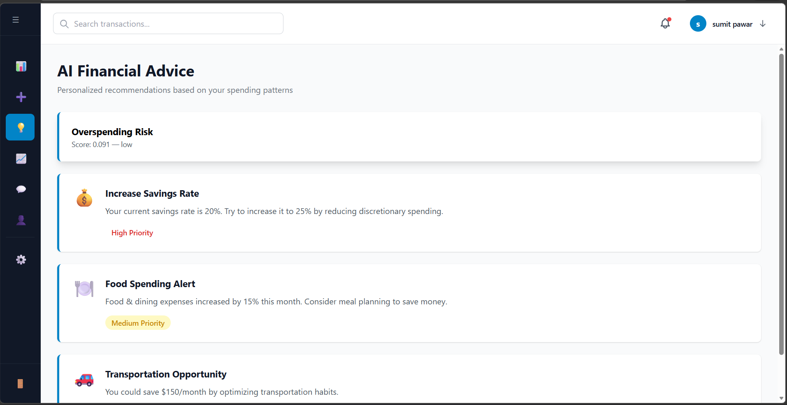

---

### 📈 Financial Analytics — Spending Trends
*AI-powered insights based on your spending patterns*

**Spending Trends (30 days):**

| Metric | Value |
|---|---|
| Total Spent | ₹1,41,121.00 |
| Daily Average | ₹70,560.50 |
| Trend | 📈 Up |
| Transactions | 6 |

**Next Month Prediction:** ₹1,41,121.00 *(Confidence: low)*

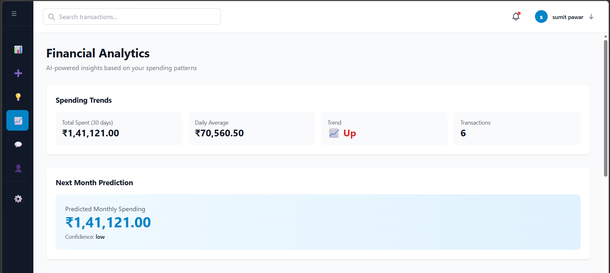

---

### 📊 Financial Analytics — Spending by Category & AI Recommendations

**Spending by Category:**
| Category | Amount | % |
|---|---|---|
| Entertainment | ₹22,000.00 | 15.6% |
| Food & Dining | ₹8,000.00 | 5.7% |
| Other | ₹50,000.00 | 35.4% |
| Transportation | ₹61,121.00 | 43.3% |
| **Total** | **₹1,41,121.00** | **100%** |

**AI Recommendations:**
- 🔴 **Rising Spending Alert** — *"Your spending is increasing. Daily average is 70560.5. Consider reviewing your budget."*
- 🟡 **Transportation Spending Alert** — *"Transportation accounts for 43.3% of your spending. This is higher than recommended."*
- 🟢 **Savings Opportunity** — *"If you reduce daily spending by 10%, you could save approximately $7056.05 per day."*

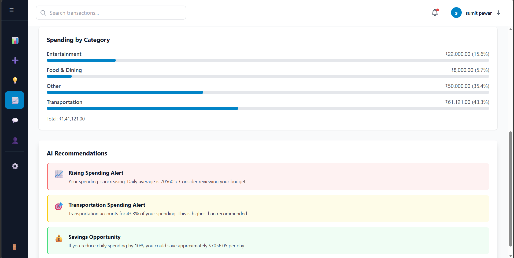

---

### 💬 AI Financial Assistant (Chat)
*"Your personal finance expert • Ready to help • Available 24/7"*

**Hello! I'm your AI Financial Assistant. I can help you with:**
- 📊 Analyzing your spending and income
- 💡 Providing personalized financial advice
- 📋 Tracking your savings goals
- 💬 Answering questions about your finances

**Try asking:**
> How much did I spend this month? • Show me my savings goals • What's my total balance?
> Give me spending advice • How much income did I earn? • Analyze my spending patterns

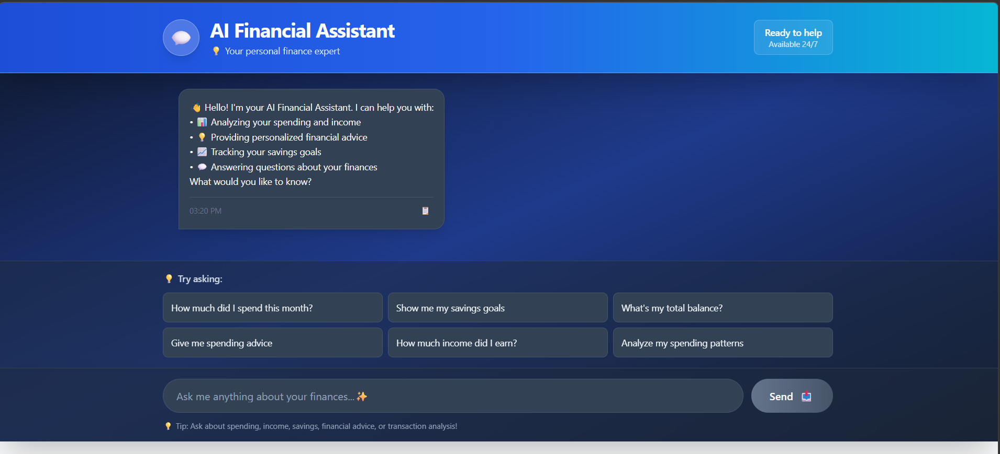

---

### 👤 Profile Settings

**Personal Information:** First Name • Last Name • Email • Phone  
**Account:** Member Since 2/21/2026

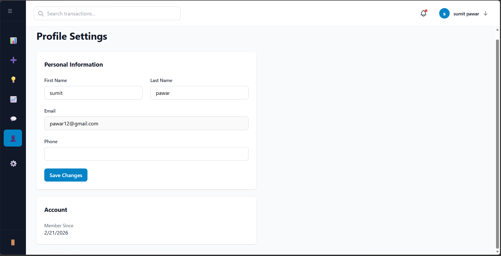

---

### 🛡️ Admin Panel *(Admin users only)*

**Admin Dashboard — System management and user administration**

| Metric | Value |
|---|---|
| Total Users | 22 |
| Admins | 1 |
| Transactions | 71 |
| Total Income | ₹19,78,034.00 |
| Total Expenses | ₹3,30,197.00 |

**Users Management:** Email • Name • Status (User / Admin) • Actions (Manage)

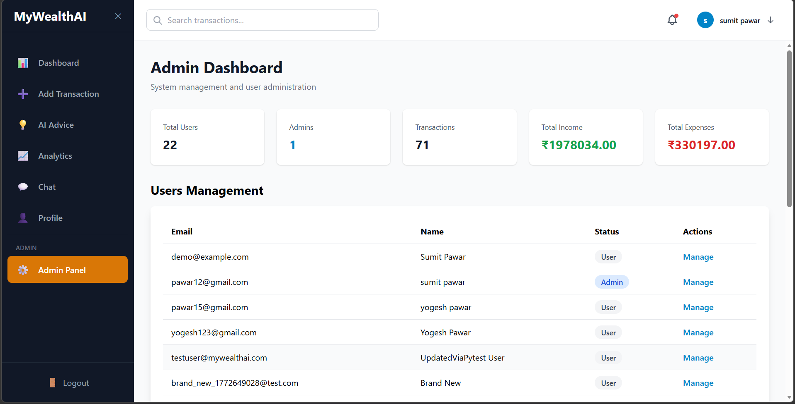

---

## ✨ Features

### 🔐 Authentication & Security
- Register with First Name, Last Name, Email and Password
- JWT-secured Sign In with auto-logout on token expiry
- Role-based access control — **Admin** and **User** roles
- PBKDF2-SHA256 password hashing — raw passwords never stored
- Data encrypted and never shared

### 📊 Dashboard
- **Total Balance, Income, Expenses, Savings** summary cards
- **Savings rate** percentage with colour coding
- **Income vs Expenses** bar chart (monthly, Oct 2025 – Feb 2026)
- **Expense Categories** pie chart
- **Recent Transactions** list with Download Report (CSV) button
- Global **Search transactions** bar

### 💳 Transaction Management
- Add **Income** or **Expense** transactions
- Fields: Transaction Type, Category (Salary / Entertainment / Transportation / Food & Dining / Other), Amount, Description, Date
- Income shown in green (+), Expenses in red (−)
- Download Report & View All buttons

### 💡 AI Financial Advice
- **Overspending Risk Score** (e.g. 0.091 — low)
- Priority-tagged advice cards: **High Priority**, **Medium Priority**
- Real alerts: Increase Savings Rate, Food Spending Alert, Transportation Opportunity
- Personalized recommendations based on actual spending patterns

### 📈 Financial Analytics (ML-Powered)
- **Spending Trends** — Total Spent (30 days), Daily Average, Trend direction, Transaction count
- **Next Month Prediction** — ML forecast with confidence level
- **Spending by Category** — progress bars with ₹ amounts and percentages
- **AI Recommendations** — Rising Spending Alert, Transportation Alert, Savings Opportunity

### 💬 AI Financial Assistant
- Groq chatbot — *"Your personal finance expert, Available 24/7"*
- Quick-ask suggestion buttons for common queries
- Full chat interface with message timestamps
- Prompt: *"Ask me anything about your finances...✨"*

### 👤 Profile Settings
- Edit: First Name, Last Name, Email, Phone
- Account info: Member Since date
- Save Changes button

### 🛡️ Admin Panel
- Platform stats: Total Users, Admins, Transactions, Income, Expenses
- Full Users Management table with Email, Name, Status, Manage actions
- Admin/User role management

---

## 🛠️ Tech Stack

### Frontend
| Technology | Version | Purpose |
|---|---|---|
| **React** | 18 with Hooks | Core UI framework |
| **Vite** | 5 (Lightning fast) | Build tool & dev server |
| **Tailwind CSS** | 3 | Responsive styling |
| **Chart.js** | latest | Financial data visualizations |
| **React Router** | latest | Page navigation |

### Backend
| Technology | Version | Purpose |
|---|---|---|
| **Flask** | 3.0 | REST API server |
| **SQLAlchemy ORM** | latest | Database models |
| **SQLite** | — | Database |
| **JWT Authentication** | — | Secure sessions |
| **RESTful API** | — | Client-server communication |

### Machine Learning
| Technology | Purpose |
|---|---|
| **Scikit-learn** | Random Forest models |
| **Pandas** | Data analysis |
| **NumPy** | Numerical computations |
| **Random Forest models** | Predictions & anomaly detection |
| **Statistical analysis** | Spending pattern insights |

---

## 🚀 Getting Started

### Prerequisites
- Python 3.10+
- Node.js 18+
- npm
- Groq API Key → [Get one here](https://console.groq.com)

### 1️⃣ Clone the Repository

```bash
git clone https://github.com/YOUR_USERNAME/MyWealthAI.git
cd MyWealthAI
```

### 2️⃣ Backend Setup

```bash
cd backend

# Create and activate virtual environment
python -m venv venv
venv\Scripts\activate          # Windows
# source venv/bin/activate     # macOS / Linux

# Install dependencies
pip install -r requirements.txt

# Create .env file
SECRET_KEY=your-secret-key-here
GROQ_API_KEY=your-groq-api-key

# Train ML models (required before first run)
python train_models.py

# Start Flask server
python run.py
```

> ✅ Backend running at **http://localhost:5000**

### 3️⃣ Frontend Setup

```bash
cd frontend

# Install dependencies
npm install

# Start development server
npm run dev
```

> ✅ Frontend running at **http://localhost:5173**

### 4️⃣ First Use

1. Open **http://localhost:5173**
2. Click **Get Started** → fill in First Name, Last Name, Email, Password, Confirm Password
3. Click **Create Account** → Sign In → start tracking!

---

## 🔌 API Reference

All protected routes require: `Authorization: Bearer <token>`

### Auth `/api/auth/*`
| Method | Endpoint | Auth | Description |
|---|---|---|---|
| `POST` | `/api/auth/register` | ❌ | Register — returns JWT |
| `POST` | `/api/auth/login` | ❌ | Sign In — returns JWT |
| `GET` | `/api/auth/verify` | ✅ | Verify token |
| `GET` | `/api/auth/profile` | ✅ | Get profile |
| `PUT` | `/api/auth/profile` | ✅ | Update profile |

### Transactions `/api/transactions/*`
| Method | Endpoint | Auth | Description |
|---|---|---|---|
| `GET` | `/api/transactions` | ✅ | List all transactions |
| `POST` | `/api/transactions` | ✅ | Add new transaction |
| `GET` | `/api/transactions/:id` | ✅ | Get single transaction |
| `PUT` | `/api/transactions/:id` | ✅ | Update transaction |
| `DELETE` | `/api/transactions/:id` | ✅ | Delete transaction |

### Dashboard `/api/dashboard/*`
| Method | Endpoint | Auth | Description |
|---|---|---|---|
| `GET` | `/api/dashboard/summary` | ✅ | Balance, income, expenses, savings rate |
| `GET` | `/api/dashboard/current-balance` | ✅ | Current balance breakdown |
| `GET` | `/api/dashboard/monthly-data` | ✅ | Monthly chart data |

### Analytics — ML `/api/analytics/*`
| Method | Endpoint | Auth | ML Model |
|---|---|---|---|
| `GET` | `/api/analytics/overspending-risk` | ✅ | Overspending risk score + probability |
| `GET` | `/api/analytics/spending-prediction` | ✅ | Next month forecast |
| `GET` | `/api/analytics/spending-trends` | ✅ | 30-day trend (Total, Daily Avg, Direction) |
| `GET` | `/api/analytics/spending-by-category` | ✅ | Category breakdown with percentages |
| `GET` | `/api/analytics/anomalies` | ✅ | Unusual transaction flags |
| `GET` | `/api/analytics/recommendations` | ✅ | AI recommendation list |

### Other
| Method | Endpoint | Auth | Description |
|---|---|---|---|
| `POST` | `/api/chatbot/message` | ✅ | Send message to Groq AI |
| `GET` | `/api/chatbot/health` | ❌ | Chatbot health check |
| `GET` | `/api/advice` | ✅ | AI Financial Advice list (priority-ranked) |
| `GET` | `/api/report/transactions` | ✅ | Download CSV report |
| `GET` | `/api/admin/users` | ✅ Admin | All users management |
| `GET` | `/api/admin/stats` | ✅ Admin | Platform statistics |
| `GET` | `/api/health` | ❌ | API health check |

---

## 🧪 Testing

**160 automated pytest tests — 100% pass rate**

```bash
cd backend

# Train models first (required once)
python train_models.py

# Run all 160 tests
pytest test_app.py -v

# Quick clean output
pytest test_app.py -q
```

**Result:**
```
================================ 160 passed in 6.01s ================================
```

| Test Class | Tests | Coverage |
|---|---|---|
| TestAppHealth | 5 | Health check, root endpoint, 404 handling |
| TestAuthentication | 17 | Register, login, JWT verify, profile CRUD |
| TestTransactions | 24 | Full CRUD, 5 field validations, type filters |
| TestDashboard | 14 | Summary, balance, monthly chart data |
| TestFinancialAdvice | 9 | Advice list, priority values, metrics |
| TestAnalytics | 12 | All 6 ML endpoints, risk scoring |
| TestChatbot | 7 | Groq AI chat, empty message validation |
| TestReport | 6 | CSV export, Content-Type, headers |
| TestAdmin | 7 | RBAC — 403 for non-admin users |
| TestRandomForestModel | 36 | All .pkl models load, predict, proba correct |
| **TOTAL** | **160** | **100% Pass Rate ✔** |

---

## 📁 Project Structure

```
MyWealthAI/
├── backend/
│   ├── app/
│   │   ├── routes/
│   │   │   ├── auth_routes.py           # Register, Login, JWT, Profile
│   │   │   ├── transaction_routes.py    # Full CRUD transactions
│   │   │   ├── dashboard_routes.py      # Summary, Balance, Monthly data
│   │   │   ├── advice_routes.py         # AI Financial Advice (rule-based)
│   │   │   ├── analytics_routes.py      # 6 ML analytics endpoints
│   │   │   ├── chatbot_routes.py        # Groq AI chatbot
│   │   │   ├── report_routes.py         # CSV export / download
│   │   │   └── admin_routes.py          # Admin-only user management
│   │   ├── models.py                    # SQLAlchemy (User, Transaction)
│   │   ├── ml_service.py                # ML inference service
│   │   └── __init__.py                  # Flask app factory
│   ├── models/                          # Trained .pkl files
│   │   ├── spending_predictor.pkl
│   │   ├── anomaly_detector.pkl
│   │   ├── category_predictor.pkl
│   │   └── trend_analyzer.pkl
│   ├── ML_Models/
│   │   ├── MyWealthAI.ipynb             # Overspending risk model notebook
│   │   └── overspending_risk_model.pkl
│   ├── train_models.py
│   ├── run.py
│   ├── test_app.py                      # 160-test pytest suite
│   └── requirements.txt
│
├── frontend/
│   ├── src/
│   │   ├── pages/
│   │   │   ├── Dashboard.jsx
│   │   │   ├── Transactions.jsx
│   │   │   ├── Analytics.jsx
│   │   │   ├── Advice.jsx               # AI Financial Advice
│   │   │   ├── Chat.jsx                 # AI Financial Assistant
│   │   │   ├── Profile.jsx              # Profile Settings
│   │   │   ├── Login.jsx
│   │   │   └── Register.jsx
│   │   ├── components/
│   │   ├── services/
│   │   └── App.jsx
│   ├── package.json
│   └── vite.config.js
│
├── screenshots/                         # App screenshots for README
└── README.md
```

---

## 🔒 Environment Variables

Create `.env` in `backend/`:

```env
SECRET_KEY=your-super-secret-key-change-in-production
GROQ_API_KEY=your-groq-api-key
DATABASE_URL=sqlite:///mywealthai.db
FLASK_ENV=development
```

---

## 🌱 Future Improvements

- [ ] Migrate SQLite → PostgreSQL for production
- [ ] Add Google / GitHub OAuth login
- [ ] Mobile push notifications for spending alerts
- [ ] PDF report export in addition to CSV
- [ ] Budget planning module with monthly targets
- [ ] Multi-currency support
- [ ] Deploy to cloud (AWS / Render / Vercel)

---

## 📄 License

This project is licensed under the [MIT License](LICENSE).

---

## 🙏 Acknowledgements

- [Groq](https://console.groq.com) — AI Financial Assistant
- [scikit-learn](https://scikit-learn.org) — Random Forest ML models
- [Flask](https://flask.palletsprojects.com) — Backend framework
- [React](https://react.dev) — Frontend framework
- [Vite](https://vitejs.dev) — Build tool
- [Tailwind CSS](https://tailwindcss.com) — Styling

---

<div align="center">

Made with ❤️ by **Sumit Pawar** — Design Project 2025–2026

⭐ **Star this repo if you found it helpful!**

</div>